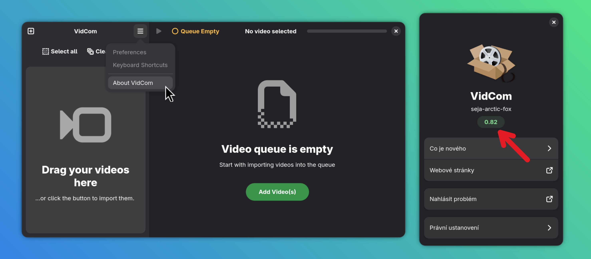

Contributing to VidCom
======================

Thank you for deciding to contribute! Contributions are welcome in this project, that's why it's public and open source! By contributing, you can make this app better for all of us. Please read this document before starting. 

Licence
-------

The source code is publicly available under GNU GPL-3.0 licence. 

Code of Conduct
---------------

First of all, this project follows the [GNOME's Code of Conduct](https://conduct.gnome.org/). Please be kind and respect others, act professionally. 

Creating issues
-------------

If you found a **bug** and want to report it, please go through these steps first:

- Are you using the newest version of the app? You can check the version by opening the app, clicking on the hamburger menu, then "About VidCom". The version number is displayed right under the app name. If your install does not match the newest version available, UPDATE FIRST by using:
```bash
flatpak update
yay -Syu
# or by building from the newest source
```



- Try to reliably reproduce the problem. Things rarely go wrong randomly
- Get as much information as you can. Run the app in the console, check if any errors are listed, observe the app's behavior, ...
- Read the README, check the issues and pull requests. Maybe it is a known issue and has been found already. Maybe it is an intended feature. 

While writing a bug report, include:

- What is the problem? What is going wrong? 
- What did you expect to happen?
- Steps to reproduce the bug (ideally the easiest way you found)
- Include relevant information; screenshots, videos, logs, ...
- (Optionally) Suggest a way the problem can be fixed... or fix it yourself, if you want :)

---

If you have a **suggestion**, follow a similar set of steps: 

- Update first to see the newest state
- Check the project's information, state and history to understand the project's direction and roadmap
- Focus on one feature at a time
- Describe in detail what would you want to see in this project in the future
- Include mock ups, screenshots, drawings if you like, to illustrate your idea
- If you are a developer, you can include a potential way to add this or you can implement it yourself and create a pull request

Please discuss with developers of this project and be ready to provide additional information if requested. Cooperate with others and let others know about your plan to keep things organised. In the case of bug reports, you can also test the fixes and let developers know. **Low effort issues, lack of information/testing or no activity are valid reasons for closing an issue. ** 

Contributing code
-----------------

If you've decided to help with development, then that's great! Please read this section for more information.

### General information and guidelines

- The project is written in **C++**
- The project uses **Meson** build system. 
- There should be no warnings or reports during compile time. 
- Comment where context is needed, write them brief, to the point, preferably in English (I know the code is full of Czech comments, will translate them in the future)
- Keep the line length under 80 characters for easy viewing (again, this is yet to be normalised everywhere)
- Try to figure out the easiest way to implement things. Don't overcomplicate things, do not add unnecessary dependencies. 
- Respect the existing file and code structure. 
- Focus on one feature/problem at a time
- You are expected to understand the app's code and what is your contributed code doing. Your contribution is your responsibility until merged
- Test your contributed code before creating a PR
- Discuss your code with other developers
- There are two important branches:
    * `main` for the working code (native build)
    * `flatpak` for changes specific to Flatpak version of the app

### Building

- described in the `README.md`:

```bash
meson setup build
meson devenv -C build
meson compile
```

There is one `meson.build` file located in the project's root. The second `meson.build` is in the `./data` directory and serves for compiling GSettings during both ordinary compiling and installation.

### Guide for contributing

- First start by forking the repository (or cloning, if you are a contributor)
- Create a separate branch for your code and name it appropriately
- Make your changes, add your code
- Open a pull request targeting the `main` branch
    * Describe your contribution
    * What does it add/remove/change/fix and why?
    * How did you achieve it? Briefly describe your code and used methods
    * Did you test it? How?
    * Additionally add screenshots, videos, logs, etc..
- Discuss with developers/maintainers until PR close

The project's owner reserves the right to not include your changes/implementation or request/make changes to contributed code before merge. 

Proper usage of AI tools
------------------------

AI (Artificial intelligence) tools, be it LLMs or other, are like any other tools and thus should be used responsibly. **No tool can do your work entirely for you,** but it can enable you to achieve things faster, make your life easier. Please follow these points:

- "Vibe coding" is fine for a quick demonstration or mock-up, but is not considered a responsible usage of AI. Code merged into `main` must not be entirely vibecoded. 
- Fully autonomous AI agents are not allowed for this project. 
- AI tools may be used for research, learning, examples, experimenting, but not for writing code for the app itself. Developers using these tools are expected to write and understand their own code, test it properly and discuss it with others. 
- **Automating discussion, writing comments or PR/issue descriptions entirely or mostly with LLMs will get your contributions closed.** Communicate with others yourself, don't let AI manage your conversation for you!